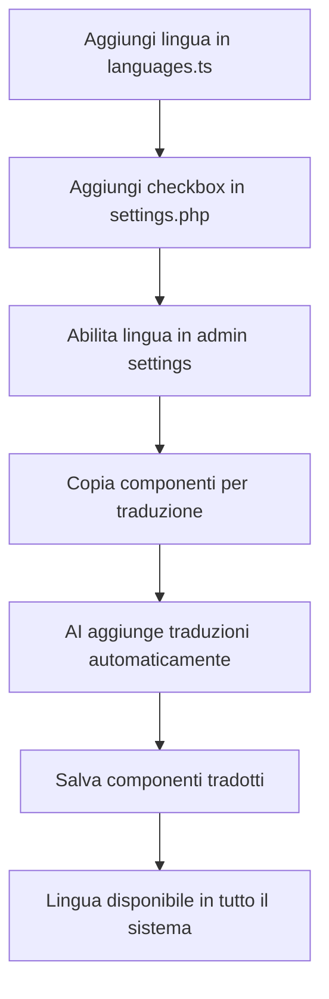

# 🌍 Guida: Come Aggiungere Nuove Lingue al Sistema

## 📋 Panoramica

Il sistema supporta traduzioni multilingua in **backend (admin)** e **frontend (report/email)**.

Attualmente supportato:
- 🇮🇹 Italiano (base, obbligatorio)
- 🇬🇧 Inglese
- 🇩🇪 Tedesco
- 🇫🇷 Francese
- 🇪🇸 Spagnolo
- 🇵🇹 Portoghese

---

## ✅ Procedura per Aggiungere una Nuova Lingua

### 1️⃣ Frontend (Next.js/React) - File di configurazione

**File:** `frontend/config/languages.ts`

```typescript
export const SUPPORTED_LANGUAGES: Language[] = [
  { code: 'it', name: 'Italiano', flag: '🇮🇹', enabled: true },
  { code: 'en', name: 'English', flag: '🇬🇧', enabled: true },
  // ... altre lingue ...

  // ⬇️ AGGIUNGI QUI LA NUOVA LINGUA
  { code: 'ru', name: 'Русский', flag: '🇷🇺', enabled: true },  // ✅ Russo abilitato
];
```

**Cosa fare:**
- Aggiungi la configurazione lingua con:
  - `code`: Codice ISO 639-1 (2 lettere: ru, zh, ja, etc.)
  - `name`: Nome nella lingua nativa
  - `flag`: Emoji bandiera
  - `enabled: true`: Per abilitarla subito

---

### 2️⃣ Backend (PHP Admin) - Checkbox impostazioni

**File:** `admin/pages/settings.php`

Cerca il commento `<!-- ⬇️ AGGIUNGI NUOVE LINGUE QUI -->` (circa riga 117)

Decommenta una lingua esistente o aggiungine una nuova:

```php
<!-- ⬇️ AGGIUNGI NUOVE LINGUE QUI -->
<!-- ESEMPIO: Russo -->
<div>
    <label style="display: flex; align-items: center; gap: 10px;">
        <input type="checkbox" name="languages[]" value="ru"
               <?php echo in_array('ru', $settings['languages']) ? 'checked' : ''; ?>>
        <span>🇷🇺 Russo</span>
    </label>
</div>
```

**Nota:** Il `value` del checkbox DEVE corrispondere al `code` in `languages.ts`!

---

### 3️⃣ Traduzione Componenti React

**I componenti report vengono tradotti automaticamente** tramite AI quando usi:

1. **Admin Panel → Personalizzazione Componenti**
2. Clicca **"📋 Copia tutti i 4 componenti per traduzione"**
3. Incolla in ChatGPT/Claude
4. L'AI tradurrà TUTTI i testi in TUTTE le lingue abilitate

**⚠️ Importante:** I componenti hanno oggetti `TEXTS` con traduzioni hardcoded:

```typescript
const TEXTS = {
  buttonSave: {
    it: 'Salva',
    en: 'Save',
    de: 'Speichern',
    fr: 'Enregistrer',
    es: 'Guardar',
    pt: 'Salvar',
    ru: 'Сохранить',  // ← AI aggiunge automaticamente
  },
};
```

---

## 🔧 Lingue Pre-configurate (Pronte all'uso)

Nel file `frontend/config/languages.ts` trovi già pronti:

| Lingua | Codice | Nome Nativo | Bandiera |
|--------|--------|-------------|----------|
| Russo | `ru` | Русский | 🇷🇺 |
| Cinese | `zh` | 中文 | 🇨🇳 |
| Giapponese | `ja` | 日本語 | 🇯🇵 |
| Arabo | `ar` | العربية | 🇸🇦 |
| Hindi | `hi` | हिन्दी | 🇮🇳 |
| Coreano | `ko` | 한국어 | 🇰🇷 |
| Olandese | `nl` | Nederlands | 🇳🇱 |
| Polacco | `pl` | Polski | 🇵🇱 |
| Turco | `tr` | Türkçe | 🇹🇷 |
| Svedese | `sv` | Svenska | 🇸🇪 |
| Danese | `da` | Dansk | 🇩🇰 |
| Norvegese | `no` | Norsk | 🇳🇴 |
| Finlandese | `fi` | Suomi | 🇫🇮 |
| Ceco | `cs` | Čeština | 🇨🇿 |
| Rumeno | `ro` | Română | 🇷🇴 |
| Ungherese | `hu` | Magyar | 🇭🇺 |
| Greco | `el` | Ελληνικά | 🇬🇷 |

**Per abilitarle:**
1. In `languages.ts`: cambia `enabled: false` → `enabled: true`
2. In `settings.php`: decommenta il blocco HTML corrispondente

---

## 📦 Esempio Completo: Abilitare il Russo

### Passo 1: Frontend (`frontend/config/languages.ts`)

```typescript
// Trova questa riga commentata:
// { code: 'ru', name: 'Русский', flag: '🇷🇺', enabled: false },

// Decommentala e cambia enabled:
{ code: 'ru', name: 'Русский', flag: '🇷🇺', enabled: true },  // ✅
```

### Passo 2: Backend (`admin/pages/settings.php`)

```php
<!-- Trova questo blocco commentato: -->
<!--
<div>
    <label style="display: flex; align-items: center; gap: 10px;">
        <input type="checkbox" name="languages[]" value="ru"
               <?php echo in_array('ru', $settings['languages']) ? 'checked' : ''; ?>>
        <span>🇷🇺 Russo</span>
    </label>
</div>
-->

<!-- Decommentalo: -->
<div>
    <label style="display: flex; align-items: center; gap: 10px;">
        <input type="checkbox" name="languages[]" value="ru"
               <?php echo in_array('ru', $settings['languages']) ? 'checked' : ''; ?>>
        <span>🇷🇺 Russo</span>
    </label>
</div>
```

### Passo 3: Traduzioni AI

1. Vai su **https://shop.didieffeb2b.com/admin/pages/settings.php**
2. Spunta **🇷🇺 Russo**
3. Salva impostazioni
4. Vai su **localhost:3000/my-account/reports → Personalizzazione**
5. Clicca **"📋 Copia tutti i 4 componenti per traduzione"**
6. Incolla in ChatGPT/Claude
7. L'AI aggiungerà automaticamente `ru: '...'` in tutti i TEXTS
8. Incolla il codice tradotto e salva

### Passo 4: Verifica

1. Vai su un report: **localhost:3000/my-account/reports/cc?clientCode=XXX**
2. Nel selector lingua dovresti vedere: **🇷🇺 Русский**
3. Selezionala e verifica che tutti i testi siano tradotti

---

## 🔍 File Coinvolti

### Frontend (Next.js)
- ✅ `frontend/config/languages.ts` - **Configurazione centrale**
- `frontend/components/reports/ReportBuilder.tsx` - Usa `getEnabledLanguages()`
- `frontend/components/reports/ReportTable.tsx` - Oggetto TEXTS con traduzioni
- `frontend/components/reports/ReportFilters.tsx` - Oggetto TEXTS con traduzioni
- `frontend/components/reports/ReportExport.tsx` - Oggetto TEXTS con traduzioni
- `frontend/components/reports/ComponentCustomizer.tsx` - Validazione lingue

### Backend (PHP)
- ✅ `admin/pages/settings.php` - **Form impostazioni**
- `admin/data/translation-settings.json` - Settings salvati

### API
- `frontend/app/api/components/translate/route.ts` - Traduzione AI
- `frontend/app/api/components/autofix/route.ts` - Auto-correzione AI
- `frontend/app/api/translate-email/route.ts` - Traduzioni email

---

## 🚀 Flusso Completo



---

## 💡 Best Practices

### ✅ Da Fare
- Usa sempre codici ISO 639-1 (2 lettere)
- Emoji bandiere corrette per ogni lingua
- Nomi lingue nella lingua nativa (es: "Русский" non "Russian")
- Testa TUTTE le traduzioni prima di rilasciare

### ❌ Da Evitare
- NON usare codici a 3 lettere (usa `zh` non `zho`)
- NON mischiare codici (se usi `ru` in frontend, usa `ru` in backend)
- NON tradurre nomi variabili/funzioni nel codice
- NON dimenticare di aggiornare TUTTI i componenti

---

## 🐛 Troubleshooting

### La lingua non appare nel selector
✅ Verifica che `enabled: true` in `languages.ts`

### Checkbox non appare in admin
✅ Verifica di aver decommentato il blocco in `settings.php`

### Traduzioni mancanti
✅ Ri-traduci i componenti con AI usando il button "Copia per traduzione"

### Errore "Invalid component code format"
✅ Il codice deve iniziare con `'use client'` o `import`

---

## 📞 Supporto

Per domande o problemi:
- 📖 Leggi `note_progetto.md` per dettagli sistema
- 🐛 Controlla validation errors in ComponentCustomizer
- 🤖 Usa auto-fix Claude se il salvataggio fallisce

---

**Ultima modifica:** 10 Novembre 2025
**Versione:** 1.0
